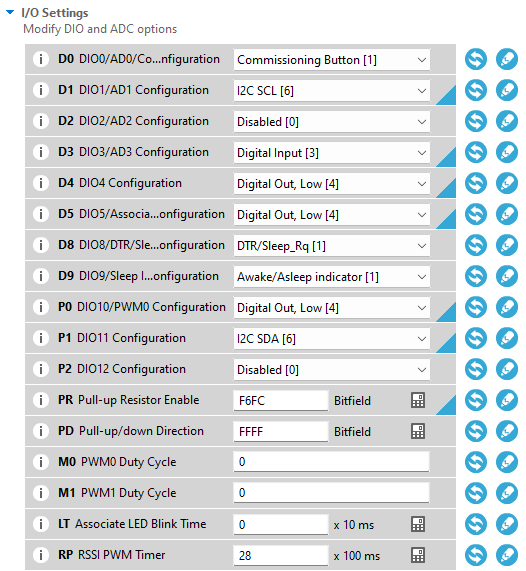
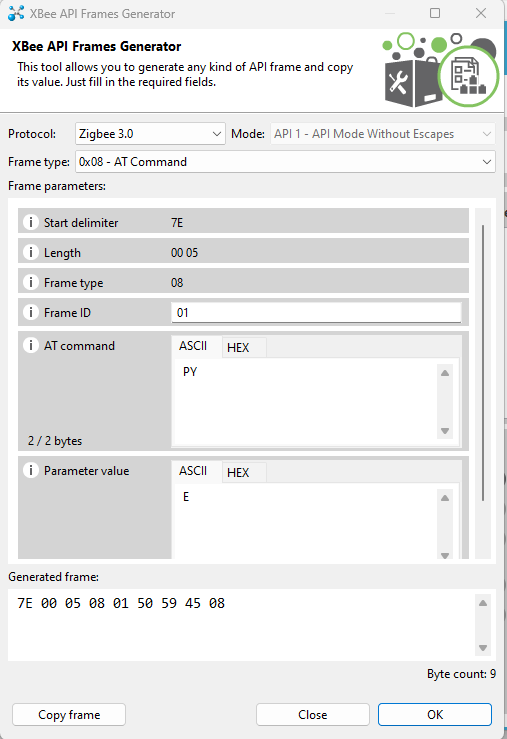
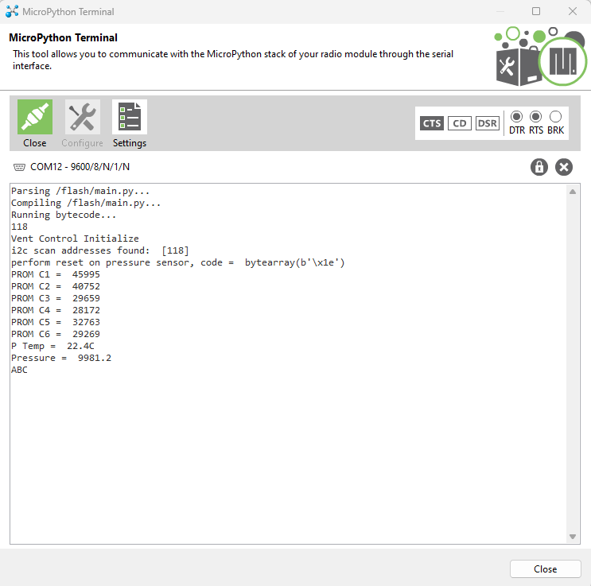

# AR BalloonSAT auto-venting module

This is Arkansas BalloonSAT's attempt to add an autonomous venting feature to the Nationwide Eclipse Ballooning Project's Engineering Track vent payload. The venting payload designed by MSU BOREALIS features separate vent and cutdown electronics that listen for commands sent via ZigBee wireless protocol from the Iridium modem payload. The vent and cutdown boards listen for particular three-character commands. For example, 'ABC' would initiate an IDLE command, 'JKL' initiates the VALVE_OPEN command, etc. Our modification to the stock software and hardware consists of a new pressure sensor and modified micropython code on the vent board to handle triggering the servo state based on pressure.

The April 8, 2024 total solar eclipse mission aims for floating the Engineering track balloons at ~95,000 ft. The vent system when triggered at ~80,000 ft should result in a stable float after 10-15 minutes. The stock system relies on teams to remotely trigger all commands via the Iridium payload. Given the traffic on the Iridium network on solar eclipse day from all the NEBP engineering teams, this modified board will automatically trigger the vent when the pressure drops to 26 mbar and aims for a steady pressure of ~15 mbar. The vent electronics includes an integrated MS5607 pressure/temperature sensor we will be using as a trigger.

In order to program these boards you will need to use XCTU and load the main.py file into the file system. The following proceedure has been adapted from the University of Maryland team's instructions for their variant of the NEBP Engineering track vent system.

Before uploading any code, set the appropriate trigger levels in main.py for your situation. We are using 27 mbar to start and aiming for 14 mbar float.

You will need to access the Xbee3 module's file system in XCTU, so begin by connecting to module via UART. Once you have the radio discovered in XCTU, switch to Configuration working mode and change API Enable to "MicroPython REPL [4]" (AP=4) and MicroPython Auto Start to "Disabled [0]" (PS=0).

 

 

You will need to enable the onboard I2C functionality, so under the I/O Settings menu turn on I2C SCL and I2C SDA on DIO1 and DIO11, respectively.

(Troubleshooting tip: ensure your I2C setup has the appropriate pullup resistors. The above image has pullup resistors attached to bits 3 & 13.)

Write that configuration to the radio then under the Tools menu select the File System Manager. Open a connection to the radio then delete its main.py file. After this, you will need to clear the device's memory. Enter the API mode to send an AT command that clears the memory. Change API Enable to "API Mode Without Escapes [1]" and write that configuration.

 

Open the Consoles working mode then open a connection to the radio. You need to send the following AT command by selecting the + button and opening the Frames Generator tool.

 

Click on the "Send selected packet" button then you should notice two new entries in the console log. The recieved packet should have 00 as the next to last pair of characters in that transmission. This indicates that the memory has been cleared and you are ready to load the fresh main.py file. This is all neccessary for making any change to the main.py file, so it can be useful to save that packet for future use. This can be exceptionally tedious while debugging code...

Open the File System Manager again and load up-to-date main.py file into file system.

Open the MicroPython terminal and connect to the radio. Type Ctrl+R to load the script. This should give you an indication that it is working. If not, check wiring, I2C pullups, etc. for troubleshooting. Make sure you set PS=1 to auto-load the python script on boot and you should be good to go.

This example shows the radio reloading the MicroPython code then displaying the I2C address, sensor calibration constants, and a single sensor reading. Your device should show the appropriate temperature and pressure. If not, some troubleshooting is in order.

This should work for any of the vent styles (stock MSU, UMD, UMDxMSU, etc.) that use the occams vent board and servo.
